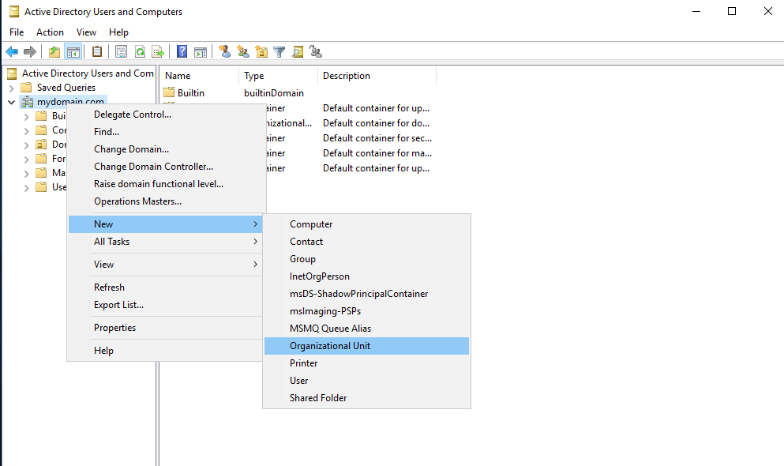

# Microsoft Active Directory | Corporate Network Environment

### Summary
Ative Directory (AD) is Microsoft's service to manage Window's domain networks. It is what most enterprises build their IT departments on.
The Active Directory database contains critical information about the environment and the services control much of the activity that goes on within the IT environment.
It connects users to the network resources they need by implementing organization and security measures. It authenticates users with the user ID and password,
and authorizes them to access only the data they are allowed to by using permission rules.
This is how the same set of credentials can be used to log into any Windows workstation within a given institution. 
This lab's purpose is to understand how Active Directory and Windows networking work by setting up a virtual environment with 1,000+ users.

### Learning Objectives:
- How to provision multiple virtual machines on VirtualBox
- Install and configure Windows Server 2019
- Create a Windows 10 ISO with Microsoft's media creation tool
- Install and configure Windows 10
- Install and configure Microsoft's Active Directory Domain Services (AD DS)
- Create 1,000+ users with Windows PowerShell
- Enterprise level user management

### Tools and Requirements:
1. Oracle VirtualBox
2. Windows Server 2019 ISO
3. Windows 10 ISO
4. Directory service: Active Directory Domain Services (AD DS)
5. PowerShell

### Overview:

## Step 1: Download and Install [Oracle VirtualBox](https://www.virtualbox.org/wiki/Downloads)
- Select the appropriate download based on the current host OS
- Install VirtualBox with the Wizard defaults or desired preferences
- Download and install the VM VirtualBox Extension Pack
> NOTE: This setup will use a Windows 11 host OS.

## Step 2: Download [Windows Server 2019 ISO](https://www.microsoft.com/en-us/evalcenter/download-windows-server-2019)
- English (United States)
- ISO File 
- 64-bit edition

## Step 3: Download Microsoft's [Media Creation Tool](https://www.microsoft.com/en-us/software-download/windows10) and Windows 10 ISO
> NOTE: In order to download the Windows 10 ISO the media creation tool is required.

### Create Windows 10 Installation Media 
- Select **Download Now**
- Install with defualt options
- Follow the the prompts to download the Windows 10 ISO file.

#### What do you want to do?
- **Create installation media (USB flas drive, DVD, or ISO file) for another PC**

#### Select language, architecture and edition
- **Language:** English (United States)
- **Edition:** Windows 10
- **Architecture:** 64-bit (x64)
> NOTE: Keep recommended options, otherwise uncheck button to edit selections.

#### Choose which media to use
- **ISO file**
- Click **Finish** to exit the program

## Step 4: Create and Configure Domain Controller Virtual Machine
#### Virtual Machine Name and Operating System
- Open VirtualBox and select **Machine** to bring a drop down menu and select **New**
- **Name:** Domain Controller
- **Type:** Microsoft Windows
- **Version:** Other Windows (64-bit)

#### Hardware
- **Base Memory:** 2048 MB (2GB)
- **Processors:** 2-4 CPUs

#### Virtual Hard Disk
- **Disk Size:** 50.00GB

#### Settings
- **General** > **Advanced** > **Shared Clipboard** > **Bidirectional**
- **General** > **Advanced** > **Drag'n'Drop** > **Bidirectional**
> NOTE: These options will enable copying and pasting, as well as dragging and dropping between host and VM
- **Network** > **Adapter 1** > **Attatched to:** NAT
- **Network** > **Adapter 2** > Check **Enable Network Adapter** Box > **Attatched to:** Internal Network

## Step 5: Install Windows Server 2019 and Change PC Name
### Install Windows Server 2019
- Double click the **Domain Controller** VM
- It will fail to boot because it is missing the OS
- Select the DVD dropdown menu and find the Windows Server 2019 ISO file
- Click **Mount and Retry Boot**

- Select Windows Server 2019 Standard Evaluation (Desktop Experience)
- Select **Custom: Insall Windows only (advanced) and click **Next**
- Configure Administrator account:
    - **Username** Administrator
    - **Password** Password1
- To press **CTRL+ALT+DEL** Select **Input** > **Keyboard** > **Insert CTRL+ALT+DEL**

- Login and close out of notifications and pop ups
- On VM menu select **Devices** > **Insert Guest Additions CD Image**
- Open **File Explorer** > **This PC** > **CD Drive D: VirtualBox Guest Additions** > **VBoxWindowsAdditions-amd64**
- Select **I want to manually reboot later** and click **Finish**
### Change PC Name
- Right-click **Windows start icon** > **System** > **Rename this PC**
- Name it "DC" > **Restart later** 
- Manually shutdown the VM and restart

## Step 6: Configure Internal and External NICs
- Select the network icon on the bottom right of the screen and click **Network** > **Change adapter options**
- Right-click **Unidentified Network** > **Status** > **Details**
- It will not have internet access because the adapter is looking for a DHCP server that has not been configured yet

- Rename adapters accordingly:
  - Ethernet 1: INTERNETexternal
  - Ethernet 2: INTRANETinternal
  

- Right-click the internal network adapter and select **properties**
- **Internet Protocol Version 4 (TCP/IPv4)**
  - **IP:** 172.16.0.1
  - **Subnet Mask:** 255.255.255.0
  - **Default Gateway:** <Empty> 
  > NOTE: The Domain Controller will serve as the Default Gateway
- Installing Active Directory automatically installs DNS therefore the server will use itself as the DNS server
  - **Preferred DNS Server:** 127.0.0.1 (Loopback address)

## Step 7: Install Active Directory Domain Services (AD DS) and Create a Domain
### Install AD DS
- **Server Manager** > **Add roles and features**
- Under **Server Roles** check the **Active Directory Domain Services** box > **Add features**
- Continue to click **Next** with the default options and **Install**
- Within the Server Manager Dashboard click the **Notifications Flag Icon** > **Promote this server to a domain controller**

### Create a Domain
- Under **Deployment Configuration** > **Add a new forest**
  - **Root domain name:** "mydomain.com"
- Under **Domain Controller Options** > **type the Directory Services Restore Mode (DSRM) password** you would put the restoration password
  - **Password:** Password1
- Continue to click **Next** with all the default fields and **Install**

### Create a Dedicated Admin User Account
- **Start** > **Windows Administrative Tools** > **Active Directory Users and Computers** 
- Right-click **mydomain.com** > **New** > **Organizational Unit**
  - **Name:** "_ADMINS"
> NOTE: This will not give it the admin permissions yet. That will be configured later

- Right-click the **_ADMINS** Organizational Unit > **New** > **User**
- Fill out first and last name
  - E.g. John Doe's administrator account: a-jdoe 
  - **Password:** "Password1" 
  - Uncheck **User must change password at next login** 
  - Check **Password never expires**
> NOTE: The "a-" is to signify that it is an administrator's account
- Right-click new user > **Properties** > **Member of** > **Add** 
- Enter "domain admins" into field and press **Check Names** to resolve itself
- Press **Ok** > **Apply** > **Ok**
- Sign out of the Domain Controller and login with new credentials

## Step 8: Install Remote Access Server (RAS) and Network Address Translation (NAT)
### Install RAS
> NOTE: This will allow the clients in the domain access to the internet through the Domain Controller.
- In the Server Manager Dashboard select **Add roles and features** 
- Under **Server Roles** check the **Remote access** box
- Under **Role Services** check the **Routing** box and click **Add features**
- Click **Next** with defaults and **Install** 
### Install NAT
- **Tools** > **Routing and Remote Access**
- Right-click **DC Local** > **Configure and Enable Routing and Remote Access**
- Select **Network Address Translaion (NAT)**
- Select the "INTERNETexternal" NIC
> NOTE: If the option is greyed out, cancel the operation and try again

## Step 9: Set up a Dynamic Host Configuration Protocol (DHCP) Server
> NOTE: This will allow Windows 10 clients to obtain an IP address and browse the internet 
- In the **Server Manager** Dashboard select **Add roles and features**
- Under **Server Roles** check the **DHCP Server** box > **Add features** 
- Click **Next** with defaults and **Install**
- Go to **Tools** > **DHCP**
- Right-click **IPv4** > **New scope**
- Name the scope with the IP address range (172.16.0.100-200)
  - **Scope Name:** "172.16.0.100-200"
  - **Start IP Address:** 172.16.0.100
  - **End IP Address:** 172.16.0.200
  - **Length:** 24 (/24 CIDR)
  - **Subnet Mask** 255.255.255.0
- Set the default gateway to the Domain Controller's IP address and click **Add**
  - **Router (Default Gatweway):** "172.16.0.1"
- Click **Next** with all other defaults and **Finish** 
> NOTE: IPv4 DHCP might still be red and down so right-click **dc.mydomain.com** > **Authorize** and **Refresh** 

## Step 10: Use PowerShell Script to add 1,000+ Users
### Enable Web Browsing on Domain Controller
> NOTE: This will be done for the lab ONLY. It should never be replicated in an actual production environment for security reasons.
- **Configure this local server** > Disable **IE Enhanced Security Configuration**
- Select **OFF** for **Administrators** and **Users** 
### Download the PowerShell Script
- Open Internet Explorer to download the [PowerShell Script](https://github.com/joshmadakor1/AD_PS) to the Desktop (Written by Josh Madakor)
- **Code** > **Download Zip**

- Open the "names.txt" file and add your name to the top of the list and save
- **Start** > right-click **Windows PowerShell ISE** > **More** > **Run as administrator** 
- Click the **Open Script** > "1_CREATE_USERS.ps1"
- Enable the Execution of all Scripts on Server
- In the PowerShell command line type: `Set-ExecutionPolicy Unrestricted` and hit **Enter** > **Yes to All** 

> NOTE: In essence this script will take the names from "names.txt" and save them into an array ($USER_FIRST_LAST_LIST = Get-Content .\names.txt)
The script will loop for each user and separate the first name from the last name. 
It will take the first name's first letter and join it to the last name to create a username and it will give them all the same password 
($PASSWORD_FOR_USERS   = "Password1").
Finally it will go through the process of adding each user to the domain (New-AdUser).

### Execute the Script
- Change directory in PowerShell's command line: `cd c:\Users\<username>\Desktop\AD-PS-master` and hit **Enter**
- Click the green **Play** button > **Run once**

- Go to **Server Manager** > **Active Directory Users and Computers** > right-click **mydomain.com** > **Refresh**
- It should now show the **_USERS** Organizational Unit with all the users created from the script
- To search for a specific user right-click **_USERS** > **Find** 

> NOTE: The users from the PowerShell Script now appear in AD.

> NOTE: User Jim Halpert has been imported from the names.txt file and added to AD with the help of PowerShell

## Step 11: Create and Configure Windows 10 Client VM
#### Virtual Machine Name and Operating System
- Add a new VM
- **Name:** CLIENT1
- **Type:** Microsoft Windows
- **Version:** Windows 10 (64-bit)

#### Hardware
- **Base Memory:** 2048 MB (2GB)
- **Processors:** 2-4 CPUs

#### Virtual Hard Disk
- **Disk Size:** 50.00GB

#### Settings
- **General** > **Advanced** > **Shared Clipboard** > **Bidirectional**
- **General** > **Advanced** > **Drag'n'Drop** > **Bidirectional**
- **Network** > **Adapter 1** > **Attatched to:** Internal Network

## Step 12: Install and Configure Windows 10
### Install Windows 10 ISO
- Double click the **CLIENT1** VM
- Select the DVD dropdown menu and find the Windows 10 ISO file
- Click **Mount and Retry Boot**

- **I don't have a product key**
- **Windows 10 Pro**
- **Custom: Insall Windows only (advanced)** and click **Next**
- **I don't have internet**
- **Set up for an organization**
- **Domain join instead**
- Add user account information
  - **Name:** user
  - **Password:** No password
- Disable all tracking privacy settings
- Skip customization services and Cortana

## Step 13: Verify Internet Connectivity

- **Start** > "cmd"
- Type `ipconfig`
- Ping a website like Google: `ping www.google.com`

> NOTE: DHCP is working on Domain Controller. CLIENT1 has an IP address leased to it and the default gateway is set to the DC's IP address.

## Step 14: Rename PC and Add to Domain
- **Start** > **Settings** > **System** > **About** > **Rename this PC (advanced)**
- Click **Change** and name "CLIENT1"
- Click **Member of Domain:** and add "mydomain.com" > **Ok** 
- Sign in with admin account to give CLIENT1 permissions to join domain
- **Close** and **Restart now**

## Step 14: Login With Generated User Credentials

- Select **Other user** on CLIENT1
- Use any of the usernames and password that were created with the PowerShell script to login
- **Start** > "cmd"
- Type `whoami`

